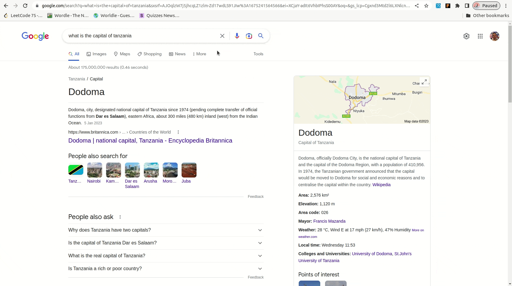

# Flashcard adder
Flashcard adder creates simple flashcards with a `front`, and `back`.

Once a list is complete enough, it can be exported as a spreadsheet('.csv' file), 
which can be imported into Anki web.

## Features
* Create a flashcard with a simple front and back. 
* View list of created cards.
* Edit/delete card from list.
* Export card list as '.csv' file which can be imported into Anki.
* Cards are saved to browser storage on card save/delete. 

## Contributions welcome
Please share suggestions(issues), find bugs or just jump on a merge request. 

